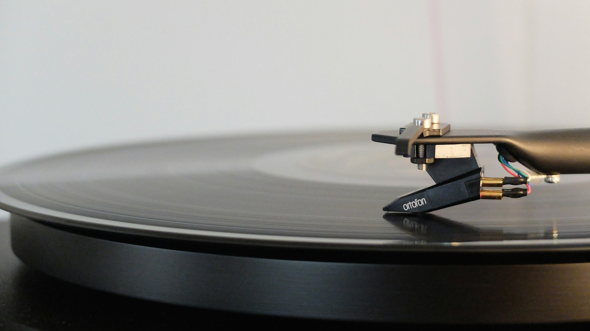

[인디피 아티클] 매장 음악, 어떻게 골라야 하나요? 매장 유형별 음악 큐레이션 방법 (조용한 카페 vs 활기찬 펍)
=

매장 음악 서비스 / 매장 음악 큐레이션 인디피 / Unsplash

**매장 음악, 어떻게 골라야 할까요?**
-----------------------

매장 음악으로 어떤 것을 해야 할지 고민이신가요?

사실 그 정답은, 고객이 머무는 동안 **어떤 행동을 하며**, **무엇을 위해 방문하는가**에 달려 있습니다.

음악은 분위기 요소를 넘어서, 고객의 **행동 방식**과 **매출을 설계**할 수 있는 도구인 것이죠.

조용한 카페 음악 / 인디피 / 리틀포레스트

**☕ 조용한 카페 vs 활기찬 펍**
---------------------

매장 유형에 따라 **음악 전략**도 달라져야 합니다.

예를 들어 카페를 운영한다고 할 때,

가장 먼저 생각해야 할 건 **“우리 매장은 어떤 공간인가?”**입니다.

이 전략은 **‘000 하는 공간’**처럼 키워드로 정리될 수 있죠.

* 조용한 카페에는 **휴식**과 **집중**을 원하는 손님들이 방문하고
* 활기찬 펍에는 **사람들과의 교류**와 **에너지 해소**를 원하는 손님들이 방문합니다.

공간의 **목적**이 다르니, 당연히 어울리는 음악도 달라져야 하는 것입니다.

카페 음악 플레이리스트 / 합정 이고수플레

**조용한 카페에 어울리는 음악은?**
---------------------

> “우리 카페는 사람들이 조용히 공부하거나 휴식을 취하는 공간이에요.”

이런 공간에는 감정을 자극하기보다 **편안함을 유지해주는 음악이 필요**합니다.

* **큐레이션 키워드**: 잔잔함, 따뜻함,
* **추천 장르**: 재즈, 로파이, 어쿠스틱, 인스트루멘탈
* **추천 플레이리스트**:
  + 잔잔한 재즈 BGM
  + 햇살 가득한 오후의 어쿠스틱
  + 밝고 편안한 인디 감성 음악

#### **실제 사례**

인디피가 큐레이션한 **방그레 커피**에서는 고객에게 **편안함을 선사하는 따뜻한 음악**을 선별해 공간에 녹여냈습니다.

술집 음악 플레이리스트 / 인디피 / 주도락 / 출처 : 네이버 지도

**활기찬 펍에 어울리는 음악은?**
--------------------

> “사람들이 신나게 술을 마시고 떠들 수 있는 공간이에요.”

그렇다면 너무 잔잔한 음악은 독이 될 수 있습니다.

템포가 빠르고 흥이 나는 음악을 틀면 분위기는 자연스럽게 살아나고, 회전율도 증가해 음료 소비량도 늘어날 수 있죠.

* **큐레이션 키워드** : 트렌디, 에너지, 리듬감
* **추천 장르** : 팝, 시티팝
* **추천 플레이리스트**
  + 감각적인 트렌디한 팝
  + 시티팝으로 채운 펍 무드

#### **실제 사례**

인디피는 **주도락이라는** 매장과 협업하여, **손님들의 기분을 끌어올리는 트렌디한 음악 큐레이션**을 진행하고 있습니다.

공간 음악 서비스 / 광고없는 매장 음악 / 인디피

**인디피의 제안**
-----------

매장 음악은 이러한 방식으로 분위기뿐 만 아니라,

손님들의 **행동 방식과 매출**을 설계할 수 있습니다.

손님이 오래 머무를지, 금방 빠져나갈지,

더 많은 음료를 주문할지, 그냥 한 잔만 마실지, 음악이 결정할 수 있는 것이죠.

여러분의 매장이 어떤 음악을 틀고 있는지는,

**여러분이 어떠한 공간을 만들고 싶은지에 대한 답**입니다.

매장 분위기를 바꾸고 싶다면, 인디피와 함께 음악부터 설계해 보세요.

**인디피 – 음악으로 공간의 가치를 바꾸다**

홈페이지 : <https://verby.co.kr/>

인스타그램 : <https://www.instagram.com/indp.music.official/>

서비스 신청 : <https://docs.google.com/forms/d/e/1FAIpQLScfepu7T2oEAzupLsJZ95jfKWbj-yGy3KVSXSgvaGNIvXEElA/viewform>