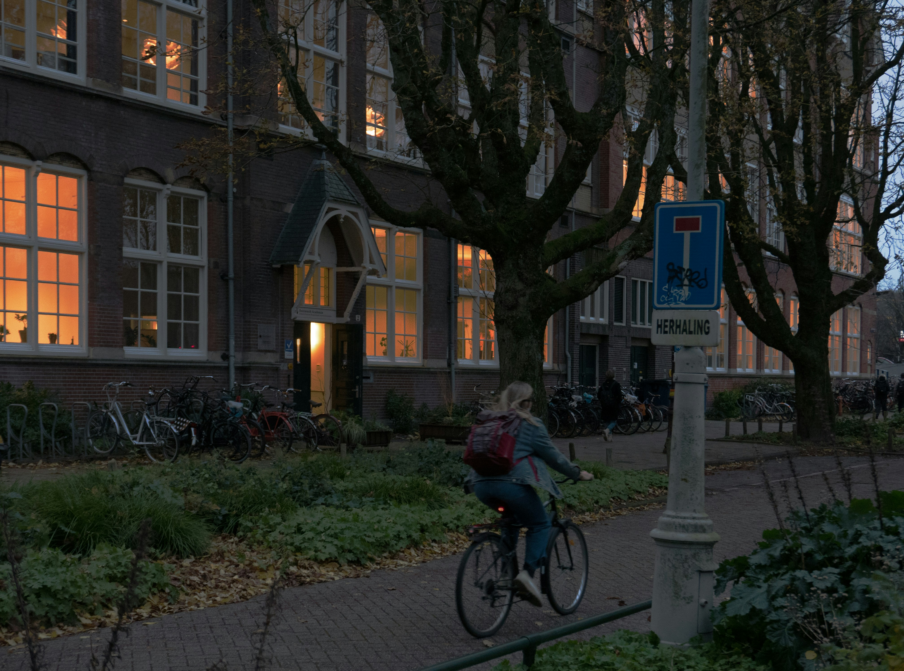

[INDP Playlist] 업무가 남았지만 아 몰라 퇴근할 때 들으면 좋은 팝송
=
### 

퇴근길 플레이리스트 / Unsplash

### **여러분은 퇴근길에 어떤 음악을 듣나요?**

할 일은 아직 산더미 같고, 머리는 복잡하지만

몸은 집으로 향하고 있는 그 시간. 저만 이런 감정을 느끼는 건 아니겠죠?

"아 몰라, 오늘은 그냥 그만하고 싶다."

모든 걸 내일의 나에게 미루고 싶은 순간에 어울리는

**퇴근길 플레이리스트**를 준비했습니다.

### 

### **잔업이 남았지만 아 몰라 퇴근할 때 들으면 좋은 팝송**

<https://www.youtube.com/watch?v=bI5ftbfsYKs&t=1614s>

퇴근길 플레이리스트 / 퇴근길 팝송

* **I’ll Get Over You (feat. Mia Niles)** - Loving Caliber
* **Body to Body (feat. Andrew Shubin)** - Sture Zetterberg
* **It’s Ok If You Forget Me** - Astrid S
* **Fall In Love Alone** - Stacey Ryan
* **parachute** - John K
* **Nothin' Like You** - Dan + Shay
* **YOU & I (feat. Khalid)** - Anne-Marie
* **Letters** - Maximillian
* **Leave Before You Love Me** - Marshmello
* **Tell A Son** - Peder Elias

### 

I’ll Get Over You (feat. Mia Niles) - Loving Caliber

### **I’ll Get Over You (feat. Mia Niles) - Loving Caliber**

그중 첫 번째 곡인

**I’ll Get Over You (feat. Mia Niles)**는

관계의 끝자락에서 서로를 놓아주는 두 사람의 감정을 담고 있어요.

슬프지만 담담한 가사와 멜로디가

오늘 하루의 피로를 부드럽게 감싸줄 거예요.

**Loving Caliber**는 2005년에 데뷔한

스웨덴 출신의 인디 팝 밴드로, 감성적인 멜로디로 많은 사랑을 받고 있답니다.

플레이리스트 인디피 뮤직 / 유튜브 인디피 뮤직

**더 많은 음악이 궁금하다면?**
-------------------

퇴근길뿐만 아니라,

**공간의 분위기**나 **일상 속 순간을 더 특별하게 만들어줄 음악**이 필요하다면

유튜브에서 '인디피' 검색하고, **더 많은 플레이리스트**를 만나보세요!

<https://www.youtube.com/@indie-pendant-music>

[인디피 뮤직

음악으로 공간의 가치를 바꾸다 내 공간만의 플레이리스트 큐레이션 서비스 문의 : verbykorea@gmail.com

www.youtube.com](https://www.youtube.com/@indie-pendant-music)

매장 음악 서비스 인디피 / 카페 음악 플레이리스트

### **잠깐! 만약 가게를 운영하시는 사장님이신가요?**

인디피는 여러분의 공간에 맞는 음악을 큐레이션 해드리는 서비스입니다.

**[지금 큐레이션을 신청해 보세요!]**

**인디피 – 음악으로 공간의 가치를 바꾸다**

홈페이지 : <https://verby.co.kr/>

인스타그램 : <https://www.instagram.com/indp.music.official/>

서비스 신청 : <https://docs.google.com/forms/d/e/1FAIpQLScfepu7T2oEAzupLsJZ95jfKWbj-yGy3KVSXSgvaGNIvXEElA/viewform>